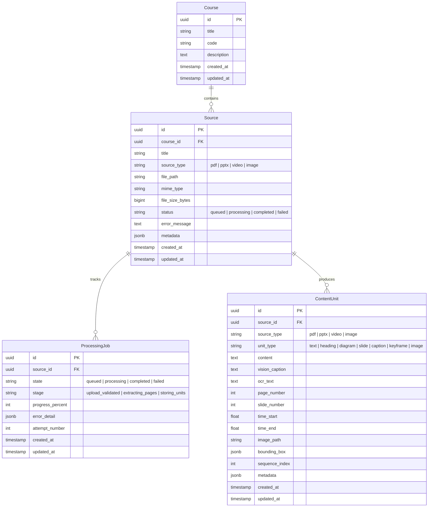

# Gide System Architecture

**Project:** Gide, Source-Grounded Adaptive Tutor  
**Track:** Multimodal AI Hackathon 2026, Track D (Personalized Tutoring & Adaptive Learning)

---

## 1. Deployed Runtime Components

Per the project specification, Gide is built with a strictly compact footprint consisting of **only 4 deployed components**:

1. **PostgreSQL (NO pgvector)**:
   - Single unified database for relational entities (`courses`, `sources`, `processing_jobs`, `content_units`) plus Phase-2 tables (`chunks`, `concepts`, `questions`, `mastery`, `evidence_events`, `assessments`, `eval_runs`).
   - Embeddings are stored as float arrays and compared with numpy over the course's chunk matrix (native Windows Postgres needs no extension); retrieval refuses to mix embedding models ("rebuild required").
   - Enforces relational integrity, cascading deletions, and strict physical provenance invariants via database engine `CHECK` constraints.
2. **Redis**:
   - High-throughput message broker and task queue state store for asynchronous multimodal ingestion jobs.
3. **FastAPI Backend (+ Arq Worker Process)**:
   - Single Python codebase running under Python 3.13 (venv).
   - FastAPI serves the REST API, OpenAPI docs, and static media mounts.
   - Arq worker runs asynchronous background jobs over Redis using Python's native `asyncio` loop without process forking, ensuring 100% native compatibility on Windows and Linux containers alike.
4. **Next.js Frontend**:
   - App Router, TypeScript, React 19, Tailwind CSS (no TanStack Query / Zustand — plain fetch via `lib/api`).
   - Provides ingestion management, job status, source-grounded media viewers (SourceViewer opens exact page/slide/timestamp), tutor, assessments, knowledge map, dashboard, study plan (/plan), flashcards (/flashcards), question audit (/audit).

*No microservices, no Celery, no LangGraph, and no external graph databases.*

---

## 2. Relational Schema & Provenance Invariants

### 2.1 Entity Relationship Diagram



### 2.2 Database CHECK Constraint (Non-Negotiable Provenance Anchor)
Every extracted knowledge unit must link directly to its physical location coordinates. The PostgreSQL engine enforces this constraint:

```sql
CONSTRAINT ck_content_unit_provenance_by_source_type CHECK (
    (source_type = 'pdf' AND page_number IS NOT NULL AND page_number > 0) OR
    (source_type = 'pptx' AND slide_number IS NOT NULL AND slide_number > 0) OR
    (source_type = 'video' AND time_start IS NOT NULL AND time_end IS NOT NULL AND time_end >= time_start) OR
    (source_type = 'image' AND image_path IS NOT NULL AND length(image_path) > 0)
)
```

Attempts to insert any content unit lacking coordinates matching its source type are immediately rejected by PostgreSQL with an `IntegrityError`.

---

## 3. Job Lifecycle State Machine

```mermaid
stateDiagram-v2
    [*] --> queued: Upload validated & job registered
    queued --> processing: Arq worker dequeues task
    processing --> extracting_pages: PyMuPDF parsing
    extracting_pages --> storing_units: Bulk insert ContentUnits
    storing_units --> completed: 100% progress & metadata updated
    processing --> failed: Exception caught & traceback recorded
    failed --> queued: POST /api/sources/{id}/retry
```




---
## Update (post Step 0)
## Update (post Step 0 + T1–T13)
Added packages inside the single FastAPI codebase: `auth`, `knowledge` (chunking, canonicalisation, builder),
`retrieval` (hybrid search + RRF fusion), `ai` (dual-provider LLM layer, tutor), `assessment` (generate/verify/service),
`learner` (model, director, service), `evaluation_api` (/system/models, /eval/runs).
   - LLM layer: per-capability providers (TEXT/EMBED/VISION = ollama|gemini) with per-provider semaphore, CPU-sized timeouts,
     exponential backoff on 429/503/timeout, one JSON repair retry; errors name the provider, never silent fallback.
     `embedding_model` is stored on chunks/concepts/questions and mismatches refuse with a "rebuild" error.
     Live latencies (evidence/t4/live_calls.log): text ollama/qwen2.5:3b 2.68s, embed ollama/nomic-embed-text 1.08s,
     vision gemini 32.77s. Flashcards reuse verified short-answer questions; audit stores marks in question.verification.audit.
